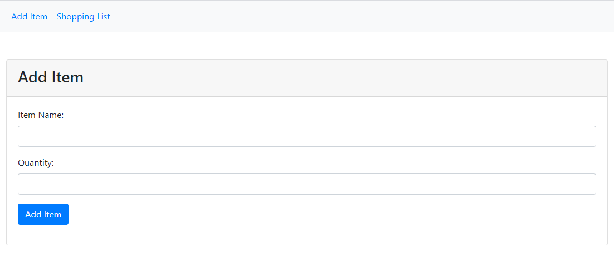
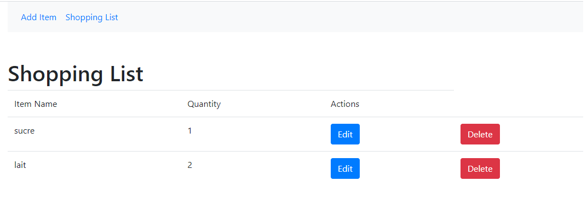

# Student Coding Challenge

There are two simple challenges to test your skills, and your curiosity on different subjects. Fell free to choose subject you prefer.
## Table of contents
1. [Backend Developer Challenge](#Backend-Developer-Challenge)
1. [Fullstack Developer Challenge](#Fullstack-Developer-Challenge)
* [Additional information](#Additional-information)

# Backend Developer Challenge
This is a simple challenge to test your skills on building APIs.
We prefer you use mainly Java and Spring boot technologies. However, you can use any language and framework that you feel more comfortable.

## What to do
Create a simple API to manage places (CRUD). This API should allow to:
- Create a place
- Edit a place
- Get a specific place
- List places and filter them by name

A place must have the following fields:
- name
- city
- state
- created at
- updated at

# Fullstack Developer Challenge
- 2 very simple screens for a very simple CRUD application using VueJS & MongoDB
- It should not be difficult to reproduce and improve

## Screenshot

Add New Item

List All Items

# Additional information
## Requirements
- All API responses must be JSON
- Provide a README.md file with usage instructions (how to run, endpoints etc)
- Provide a testing environment (heroku, docker, etc)

## Recommendations
- Tests, tests and tests
- SOLID
- Code and commits in english (methods, classes, variables, etc)

## Evaluation
- Project structure, architecture and organization
- Programming good practices
- VCS practices

> **Note:** We're interested on the structure and completeness of the API, so as how it is tested.

## Delivery

* **Source Code**: Either of the following ways to bundle the code, whatever is easier for you:
  * A `zip` file containing the whole project. Remember to skip binaries, logs, etc if you choose this option.
  * A link to an accessible public repository with your work in, in this case you have to **fork** this repository and commit the solution in a **solution** folder.
    Your repository must be public. After that, send the repository link to us.

> **More documentation on GitHub:**  * https://help.github.com/articles/fork-a-repo/

* **Documentation** / **Instructions**: You can bundle it together with the code.
  * A `Readme.md` file explaining the assumptions and decisions you've made solving this task including technology and library choices.
  * Any instructions required to run your solution and tests.
> **Note:** Remember this is not a thesis, just few lines is enough. Favour self-documenting code.

* We describe MVP ( minimum viable product) : Feel free to improve solution adding functionalities
* If you think you have a personal project that relates to the skills being assessed, or I you want to share what you have done.(Front, Back, Game, API) 
Feel free to send a link.
  
